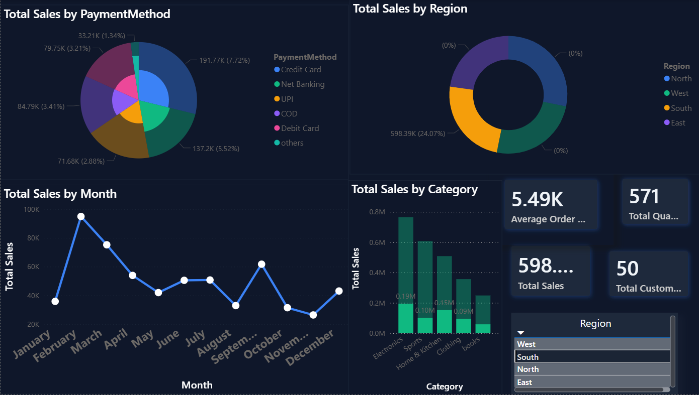

# 📊 Sales Dashboard - Power BI

## Overview
Modern dark-themed interactive sales dashboard built with Power BI. Tracks KPIs, regional performance, and product trends.

## ✨ Key Features
- **KPI Cards**: Total Revenue, Quantity Sold, Top Customer
- **Interactive Slicers**: Filter by Region, Category, Date
- **Visuals**: Bar charts, trend lines, comparison views
- **UI**: Custom dark theme #0F172A for better readability

## 🛠️ Built With
- Power BI Desktop
- DAX for calculated measures
- Power Query for data transformation

## 📸 Dashboard Preview

## 📁 Repository Contents
- `Sales_Dashboard.pbix` - Main Power BI file
- `dashboard.png` - Dashboard screenshot

## 🚀 How to Use
1. Download `Sales_Dashboard.pbix`
2. Open with Power BI Desktop
3. Explore filters and visuals

## 📝 Note
Live web link not available due to data privacy. Download PBIX to interact with the dashboard.

---
⭐ Star this repo if you find it useful!
